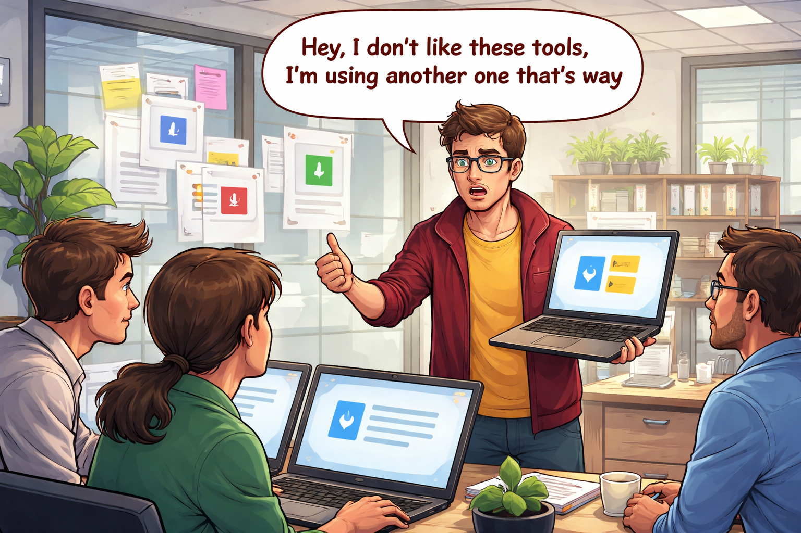
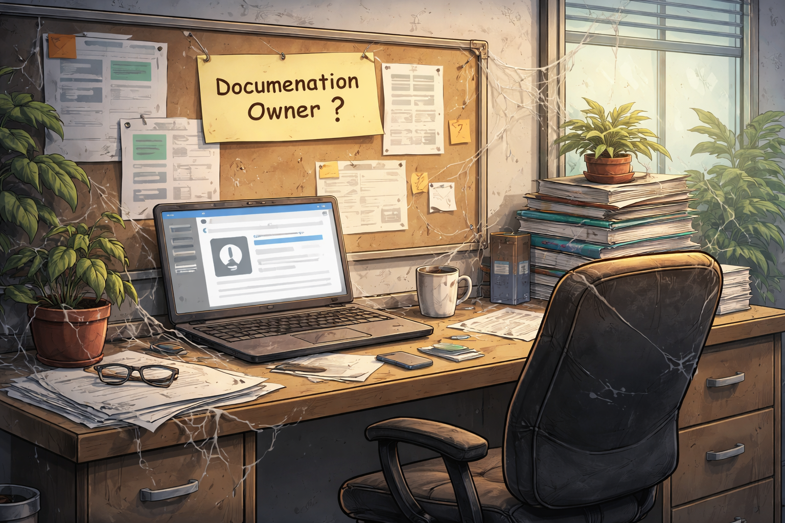
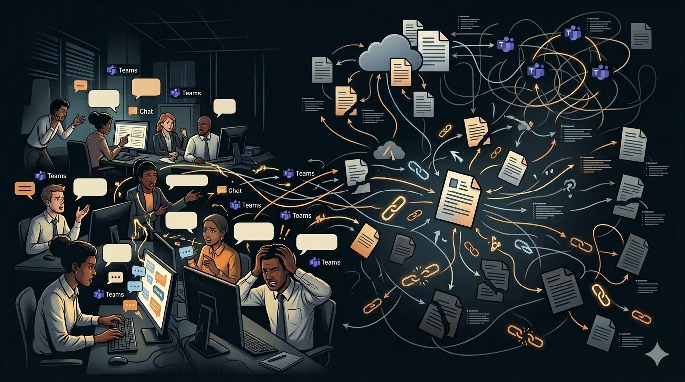

## Introduction

Technical documentation is the backbone of any successful project, particularly in software development. It serves as a comprehensive guide for understanding, installing, using, and maintaining applications.

However, many teams struggle with documentation, often viewing it as a tedious or low-value task.

In this article, I try to explain common documentation "diseases" I observed in my career by describing fictitious stories. For each of those stories, I then describe potential solutions to avoid those problems.

## Actors

For the sake of the stories, let's introduce some fictitious actors who will be involved in the different stories: Anna, Joe, Julia, Jack, Kate and Franck.

The purpose is just to have human characters, those one will be interchangeable in the different stories and will not always have the same role.

## The tool sprawl


_Image generated with AI_

### The (not) funny story

Kate is a freelance consultant, she just arrived in the company and needs to access to the documentation written by several teams (the network team, the platform team, the security team and several business teams).

She asks the architect who onboards her about **THE link to the documentation**, he says to her that the company fosters autonomy and so each team is free to write the documentation in the tool they want.

Kate decides to contact the Product Owner of each team, she obtains links to documentations written in the following tools:
- The network team sent a link to a [Google drive](https://workspace.google.com/products/drive/) folder containing a mix of [Docs](https://workspace.google.com/intl/fr/products/docs/) and [Slides](https://workspace.google.com/products/slides/) documents without any index or apparent structure.
- The platform team sent a link to static site generated with [Docusaurus](https://docusaurus.io/) and hosted on an [Amazon S3](https://aws.amazon.com/s3/) bucket.
- The security team considers it does not need too much documentation and sent a link to a [Slack channel](https://slack.com/features/channels) mainly using [Slack canvas](https://slack.com/features/canvas) to write documentation.
- The business team 1 sent a link to a [GitHub](https://github.com/) repository containing Markdown files.
- The business team 2 sent a link to [Datadog](https://www.datadoghq.com/), it mainly uses [Notebooks](https://docs.datadoghq.com/notebooks/) to write documentation and is happy with it because it's near its monitoring tools.
- The business team 3 sent a link to a [GitHub](https://github.com/) repository mainly using GitHub [Discussions](https://docs.github.com/fr/discussions) and [Wikis](https://docs.github.com/en/communities/documenting-your-project-with-wikis/about-wikis)
- The business team 4 sent a link to [Confluence](https://www.atlassian.com/software/confluence)
- Etc.

So now Kate is a little lost, she decides to create an organized list of bookmarks in her internet browser to have some sort of logic in this mess.

She had to bother several Product Owners just to get links to several documentations, she lost time to get those and now she lost a lot of time searching in all those tools which do not have the same search power and features.

She regularly bothers the Product Owners to ask for additional information, most of the time this information is inside one document but she could not find it.

### How to avoid it?

The point here is that if you let your employees freely write documentation in all the tools you have which provide documentation capacities, you'll quickly end up with a huge debt, a lot of duplicated information everywhere, impossibilities to find information when needed, a lot of confusion for your employees, etc.

The previous example was based on one set of tools, but if you take another set of tools in another company you'll reach exactly the same conclusion.

To prevent this effect I advise to take "strict" decisions from the very beginning of your documentation strategy:
- **Pick only 2 (or maximum 3) "main" tools** and link them to very **clear criteria** to let your employees know without any doubt when to write in tool A and when to write in tool B.
- **Firmly forbid the use of any other tool**, regularly explain and re-explain the reasons if necessary, hunt the fresh/groundbreaking ideas
- **Try to disable as many documentation features as possible** if they are not part of the "main" tools chosen in the enterprise.
- Even if you use 2 / 3 "main" tools elect one to act as the **unique entry point to the whole enterprise documentation** in such a way that only one link can be shared easily

Ideally those decisions should be clearly written in some sort of ADR (_Architecture Decision Record_) or an approved RFC (_Request For Comments_) to set it in stone and to be able to refer to it when you need to explain it again or prevent somebody from deviating from it.

For the first decision what I mean by criteria is just the fact that a document having a specific characteristic **must be** written in a clearly identified tool. This clear mapping should be known (it's advised to document it and to mention it in the ADR or RFC), employees can easily understand it and apply it.

As an example, let's suppose that our company chose to use [Material for Mkdocs](https://squidfunk.github.io/mkdocs-material/) and [Confluence](https://www.atlassian.com/software/confluence) as the 2 main tools for documentation. We also suppose that the company is using [GitLab](https://about.gitlab.com/) for the code repositories and that the company would like to use [Markdown](https://en.wikipedia.org/wiki/Markdown) files.

Here is an example of mapping we can define between the document types and the tools:

| Document type                                                                    | Chosen Tool           | Why?                                                                |
|----------------------------------------------------------------------------------|-----------------------|---------------------------------------------------------------------|
| Onboarding documentation                                                         | Material for Mkdocs   | Needs code review                                                   |
| Application user guides - functional                                             | Confluence            | Non-technical people do not use Git.                                |
| Application user guides - technical (for example installation guides)            | Material for Mkdocs   | Needs code review                                                   |
| Technical documentation (i.e. architecture, design, code samples, etc.)          | Material for Mkdocs   | Needs code review                                                   |
| Runbooks and Playbooks                                                           | Material for Mkdocs   | Needs code review                                                   |
| APIs documentation                                                               | Material for Mkdocs   | Needs to be near the / integrated into the technical documentation. |
| Terraform modules, Ansible roles documentation                                   | Material for Mkdocs   | Needs to be near the / integrated into the technical documentation. |
| ADRs (Architecture Decision Records)                                             | Confluence            | Needs a collaborative comment mechanism.                            |
| RFCs (Request For Comments)                                                      | Confluence            | Needs a collaborative comment mechanism.                            |
| Postmortems                                                                      | Confluence            | Needs a collaborative comment mechanism.                            |
| Application technical setup (i.e. Makefiles, CLI commands using dev tools, etc.) | GitLab `README.md`    | Needs code review + fast setup locally.                             |
| Application release notes                                                        | GitLab releases       | Usage of native feature of Gitlab.                                  |

The first mapping is generally not perfect, you can miss some document types, it's not a problem, feel free to add more document types if you see few deviations from the reality of your company. You can also add a note like this one to encourage your employees to propose updates of the mapping if they see some missing document types:

> If you feel the table misses some documentation types please contact the guild of the architects to propose an update of the table and the mapping (you can write a Merge Request in advance).

To stress the point it's also a good idea to add a clear note to forbid writing documentation in any other tool.

> You must not write any documentation in any other tool than those mentioned in the previous table (i.e. Material for Mkdocs and Confluence).
>
> For example, you must not write documentation in the following tools (this list is non-exhaustive): Google Docs, Google Sites, Slack channels and threads, GitHub Wikis and Discussions, ServiceNow description fields, Datadog Software Catalog description fields, etc.


## The detractor


_Image generated with AI_

### The (not) funny story

On day one, the company (or the IT department) was small and few persons decided to choose a main documentation tool for good reasons. The time passes, everybody is correctly using the tool and everything is working fine. From time to time, some people saw minor limitations of the documentation tool but they were not big enough to justify a change, so they just accepted it and continued to use the tool.

Until one day, Jack, a new senior employee arrives. This new employee is a highly skilled person and is at ease to communicate fluently and give all sorts of advice. A few days after his arrival this employee says "Hey, I don't like this documentation tool, I'm used to using another one which is way better!".

His other colleagues are a little surprised, they know that the current documentation tool is not perfect, but honestly it does the job pretty well, it allows writing the required documentation efficiently and the search is decent.

They try to argue with Jack, but as Jack seems really convinced that their tool is better and that the company should use it they let him go further. And then Jack decides to perform a first setup of this new tool and begins to write new documentation inside it.

And then the problems start, insidiously, we now have 2 different tools for the documentation and 2 different places to look for documentation.

- People begin to be confused and don't know where to look for documentation, what tool should be used for what purpose, etc.
- The maintenance effort is doubled.
- We have "almost all" employees knowing the old good one but only a few "informed" employees knowing the new one. Jack who encouraged a few others around his team to use the new tool did not have the time to correctly raise awareness in the whole company.
- A migration is planned but never really done because of the lack of time and motivation to do it.
- People who wrote good quality and well-organized documentation in the past begin to receive questions they did not have before. "Where is this doc?", but it has always been here at a well-known place, now a few new employees seem to not find it directly.

### How to avoid it?

Sometimes the arguments of this new employee are legitimate, but in many cases they concern "little problems" which could be fixed without too much effort and which are not big enough to justify a change of the current tool. Sometimes it's simply that this new employee is very used to using the tool he saw in his previous company, he is "in love with it", and he did not take the time to master the new one (or at least does not wish to). Or it's that a new trendy tool appeared on the market and this new employee is very excited about it and wants to use it in the company.

Always keep in mind that **what's most important is not the tool but the documentation itself!** You can write very good documentation using old tools which could appear a little "old school" and also write very bad documentation using the best and most beautiful tools in the world.

So be extremely careful when you see this kind of situation happening in your company, try to understand the reasons behind it, and try to find a solution which is good for the company and not only for the new employee.

In my opinion **the best way to avoid this problem is to refer this new employee to the ADR or RFC which defined the documentation strategy** and which we talked about in the previous section (see [The tool sprawl](#the-tool-sprawl)).

> [!NOTE]
> Even if most of the time it's definitely not a good idea to change the documentation tool, there are cases where it's really required.
>
> If you really think a change is required, I think the following elements are key:
>  - Do not think it will be easy, the cost of such changes is generally very high because the existing documentation has a lot of pages
>  - Plan the migration carefully, you should ideally have a simple mechanism to automatically migrate the pages (a migration using AI could help a lot)
>  - Track the migration progress, do not stop the migration until everything is migrated and the old tool is decommissioned (otherwise you'll fall into the tool sprawl trap)
>  - Communication is very important, present the change to your collaborators, indicate to them how the new tool works, how the migration is done and what is important for them to know


## The absent owner


_Image generated with AI_

### The (not) funny story

#### The documentation page without owner

Anna is onboarded as a backend developer of a team which needs to write a new micro-service to manage the payments. She is a very conscientious developer and wants to know how to format its application logs so those logs are correctly parsed and respect the company logging standards.

She found a documentation page about the logging standards but this one mentions an update date which is more than 3 years old without any person to contact. She talks with her colleagues about this documentation page and one of them tells her "Ah yes, this page is really old, I think it was written by Joe, a consultant who is not there anymore. I think we should still apply what he described but there are a lot of chances that the architects changed several things. I advise you to contact Julia, the chief architect, she will probably guide you to another document which is more up to date."

#### The documentation tool without owner

The company where Joe works has a static site generator to publish documentation. This tool has been set up a long time ago by Franck who is not in the company anymore. Since then, several teams provided a few improvements to the tool setup but nobody is really responsible for the maintenance. After more than 5 years the security team is worrying because the tool depends on several software libraries containing a lot of CVEs.

The security team is trying to find an owner but nobody wants to take the responsibility, all managers keep passing the buck to each other because the IT department did not allocate a budget for the maintenance of the documentation tool.


### How to avoid it?

#### The documentation page without owner

A documentation must be "living", it must be regularly updated, and it must be maintained. If you don't have an owner for your documentation you cannot have those characteristics, you will quickly end up with a huge debt, a lot of outdated information, important missing parts, or even worse, false information which can be really dangerous.

This problem can be attenuated following several pieces of advice.
- Ensuring that a documentation page is always owned by a specific team, ideally never a unique person who could leave the enterprise
- Structuring the documentation in such a way that it seems natural which team is the owner, your documentation page could also be templated to always mention the owner at the beginning of each page
- If the documentation is published through a monorepo potentially use [Code Owners](https://docs.gitlab.com/user/project/codeowners/) to make things clear
- Use your Software Catalog or CMDB to identify all the applications maintained in the enterprise, ensure there's always an owner for each application, structure the documentation by those same "service" / "application" registered in the catalog.
- Use a site analytics software to know which pages of your documentation are really viewed. For example Material for [Mkdocs natively supports Google Analytics](https://squidfunk.github.io/mkdocs-material/setup/setting-up-site-analytics/#google-analytics) and even provide a [feedback widget](https://squidfunk.github.io/mkdocs-material/setup/setting-up-site-analytics/#was-this-page-helpful) to let users indicate if a page was useful or not. If you prefer sovereign solutions you can check [European alternatives to Google Analytics](https://european-alternatives.eu/alternative-to/google-analytics). As a last resort it's not too complex to write a simple Javascript piece of code which pushes a metric to your observability platform each time a page is viewed. This should allow you to track dead pages, this tracking should be done regularly and decisions should be taken for each page.

For the structure of the documentation I advise to perform a separation between documentation associated with services/applications/products and transversal documentation. You should have one "sub-site" per service managed by a specific team, if you respect this and the mapping between services and owning teams is valid in your Software Catalog or CMDB then you are at least sure to have an owner for those "documentations by service" part.

Managing the transversal documentation is less easy, but you can find an organization which directs the document to specific jobs and responsibilities in the company. For example, it's common to have communities of architects, SREs, etc. in the enterprise.

Here is a sample structure which could be chosen.

```bash
root
 |- Onboarding             # Owner(s): HR, Managers, IT department
 |
 |- Services
 |  |- service-1           # Owner: Team associated with the service in the Software Catalog
 |  |- service-2           # Owner: Team associated with the service in the Software Catalog
 |  |- service-3           # Owner: Team associated with the service in the Software Catalog
 |  \- ...
 |
 |- SRE
 |  \- Postmortems         # Owner(s): Community of SREs + Architects
 |
 \- Architecture
     \- ADRs               # Owner: Community of Architects
```

Each service/product is managed by a specific team, so the owner is directly found. The other transversal documentation is owned by persons having transversal roles.

The previous organization proposition for the documentation of each service can quickly be hard to browse if you have a lot of services, so you could decide to refactor it a little.

If you do not have too many teams and are "almost sure" it's "not too hard" for an employee to guess which team manages which service you could opt for the following structure:

```root
 \- Services
     |- Team A
     |   |- cart-api
     |   |- payment-api
     |   |- ...
     |   \- accountability-app
     |
     |- Team B
     |   |- user-api
     |   |- customer-api
     |   |- ...
     |   |- mobile-app
     |
     |- ...
     |
     \- Team X
```

The organization by team is a little "risky" in the sense that in several companies teams are moving a lot and are not stable. Unless you have a very efficient mechanism to rename teams or transfer the ownership of services to other teams without breaking too much stuff you could prefer an organization by "kind of service" or by "large domains" which is more stable and less risky.

```bash
root
 \- Services
     |- Business services
     |   |- Cart API
     |   |- Payment API
     |   |- ...
     |   \- Accountability app
     |
     |- Platform services
     |   |- CI/CD platform
     |   |- Observability platform
     |   |- ...
     |   |- Artifact repository
     |
     |- Data services
     |   |- Data Lake
     |   |- ...
     |   |- EMR Offer
     |
     |- Security services
     |   |- Bastion service
     |   |- ...
     |   \- Vault
     |
     |- Network services
     |   \- ...
     |
     \- ...
```


#### Documentation tools owners

The second kind of owner challenge could be the owner of the documentation tools themselves.

We can generally identify 2 kinds of tools:

- SaaS tools (for example Confluence, Notion, etc.)
- Self-hosted tools (for example Mkdocs, Docusaurus, etc.)

SaaS tools are generally easier to maintain and do not require a lot of technical skills, nor maintenance effort. Here the challenge is to be sure the number of licenses is correctly managed, otherwise the cost could silently increase.

Self-hosted tools could be cheaper "as is" but they require much more maintenance effort and technical skills, this implies an obvious human cost which has to be taken into account too. Those tools also imply more responsibilities on security as they depend on several software components which have to be updated continuously to prevent security breaches. It's generally advised to automate those updates using tools like Dependabot or Renovate.

Whatever the tool you choose it's necessary to consider it as a fully-fledged product registered in your Software Catalog or CMDB and managed by a specific team with clear responsibilities and objectives.


## The update hell


_Image generated with AI_

### The (not) funny story

You have a great static doc system which renders beautiful documentation, its content is well structured, it's up to date, everything seems ok.

A new developer (let's call him Joe) arrives in the company, he's onboarded in his teams and knows that the documentation is based on those `docs/**/*.md` Markdown files. He knows that to update the documentation he has to write a Merge Request in a Git repository.

But nobody explained to him how to render the documentation locally and there is no easy/standard known way in the company to do it.

So Joe is really not at ease, he's worried about breaking the rendering of the documentation if he makes a mistake in the Markdown files. As Joe is a conscientious person he searches on the internet for solutions to create a local rendering of the documentation, he found it and decides to set it up on his machine.

After a few hours he has a setup which is working and he is happy with it, Joe has lost a lot of time just to write a simple update in the documentation, it's definitely not a good use of his time for the company, also as it's not a good experience for Joe it's probably a potential distractor for the documentation strategy of the company (see [I hate this doc tool, mine is way better!](#i-hate-this-doc-tool-mine-is-way-better).

On week 2 Jack arrives in the company, Jack has to update the documentation too. But Jack is a little less conscientious than Joe and is a little stressed about his new work, he considers that documentation is just a "side task" and he's annoyed that for such a small task he's not able to easily see his updates locally. So he decides to quickly create a Merge Request without too much testing, his colleagues perform a review of the content which is good (at least apparently) and the update is published.

Sadly the update broke several tables in an important page of the documentation, Anna an other employee which is in the company since a long time saw those broken things often in the past, and now this is even the case in this important page!

We now have 2 additional potential documentation tool distractors even if the problem is definitely not the tool but the way it is provided in the company, without any "developer experience" facilities, nor guidance from its colleagues!

Franck is in the company since several months now, he observed the same problems as Joe, Jack and Anna. But he is a junior developer and does not know that this static doc generation tool is easily callable locally, he regularly updates documentation and checks the final rendering after merge of his Merge Requests. Several times he saw the update is broken, so he creates a new Merge Request to fix the rendering. As Franck always creates Merge Requests by "guessing" / praying it will be correct he often logs several hours a day updating the documentation.

### How to avoid it?

After setting a static site generator for your documentation ensure that using it is pleasant for your collaborators.

The 3 following points are key:
- **Provide a clear, fast and easy way to render the documentation locally**. This should ideally be standardized with a well known command all employees know (for example `make docs`).
- **Ensure that the CI/CD pipelines used to generate the documentation are fast**.
- If possible (it's not always easy) provide a **rendering of the documentation associated with the Merge Requests** to let reviewers check the rendering before merging the update.
- If the IDEs and editors used by your developers contain well known plugins to have a direct view of the documentation rendering document them and advise the developers to use them.


## Can't be found


_Image generated with AI_

### The (not) funny story

Anna is a junior developer who just arrived 2 weeks ago in the company, she has been onboarded in her team and she is very excited to start working on her new project. She talked with Joe the last week, he indicated to her that there is a great documentation about the Redis Terraform module she must use for her project.

Anna just took a JIRA ticket which consists in the setup of the Redis cache from her scrum board. She first needs to read the documentation about the Redis Terraform module, but Joe is in holidays this week. After 30 minutes searching for the documentation she decides to ask her colleagues in her Team by sending a message in their team Slack channel.

Nobody knows where the documentation is because they never used Redis in the past and the usage of Terraform modules is not so common in the company for now.

So they decided to ask the Platform team by sending them another message in their support Slack channel.

They received a response 3 hours later because the Platform team is really busy and they have a lot of tickets to handle.

### How to avoid it?

- Choose a documentation tool which provides a good search engine.
- If the tool does not support a decent search engine, consider using a third-party search engine like Algolia or Elasticsearch / Opensearch to index your documentation and provide a good search experience for your employees.
- Set up a RAG to be able to quickly find the right documentation using an AI assistant (for example using a chatbot in Slack or Microsoft Teams, or using a web interface).


## The dis-aggregated doc


_Image generated with AI_

### The (not) funny story

Julia is an enterprise architect in the company, she used to work on a very specific software application during several months. She worked very well and recently received a promotion which allowed her to work on a very transversal position which requires having access to documentation associated with several different applications and services.

She is currently starting to work on a subject which requires a clear understanding of the network architecture, its relation to the Kubernetes clusters, and the way a few Helm charts are configured to set up a few network policies.

Julia knows that she needs to access the documentation written by 3 teams: the network team, the platform team and the security team. But each team has its own documentation site and manages it separately, the docs are exposed through different URLs, she tried to guess several URLs `/network`, `/network-team`, `/net`, ..., without success. She finally decided to look at the company organizational chart of the company to find the manager of each team and send a Slack message to each one to get the URLs.

Julia lost a lot of time and bothered 3 managers just to get 3 well known URLs.

### How to avoid it?

- Always **have a central access point** to the documentation with a clear structure which allows progressively drilling down to the whole documentation sub-sites.
- Set up a RAG to be able to quickly find the right documentation using an AI assistant (for example using a chatbot in Slack or Microsoft Teams, or using a web interface).


## The fuzzy GIT boundary


_Image generated with AI_

### The (not) funny story

Joe is currently working in the platform team, with his colleagues he maintains a very heterogeneous platform which requires a high diversity of skills. He often needs to enter CLI commands on several projects to execute unit and integration tests, update a static site documentation, execute Terraform and Ansible commands, etc.

The commands are different each time and he needs a quick way to find the good one depending on his work. But his workflow is really disturbed, when he looks in the `README.md` file of the GIT repository A everything's easy, but when he looks in the `README.md` the documentation is way too fat and contains architecture design stuff, user guides, runbooks, etc. However the project B contains the useful commands inside its documentation, but not at the same place as project A.

Sometimes Joe needs to understand the architecture of a specific component, the same problem appears, in project X he can find the information in the `README.md` file of the associated GIT repository, but in project Y the `README.md` is very light and the documentation is present in the static site documentation instead.


### How to avoid it?

The problem here is that the boundary between the documentation published in GIT and the one published in the static site is not clear.

My advice is the following:
- Only keep the `README.md` file in the GIT repository for the few developer setup commands of the project and **no more**. This file should be very fast to read, a developer working locally should be able to read it quickly directly inside their development environment.
- Place a link to the application's complete documentation on the static site at the beginning of the `README.md` file.
- Try to "templatize" the `README.md` files in such a way that they are all based on the same structure.


## Conclusion

When I started this article I wanted to list all the documentation pitfalls I encountered during my career. I finally opted to describe only a subset of the most important ones and I know we could list even more items.

As a conclusion we could summarize the main key points to take into account.
- Prevent tools sprawl: Pick only 2 (maximum 3) "main" documentation tools, forbid the others
- Be firm with the detractors: Clearly document your documentation strategy and the 2 / 3 officially authorized tools in an ADR or RFC to prevent deviations
- No absent owner: Structure your doc in such a way that owners are natural, have a structure which reflects the list of services in your Software Catalog or CMDB
- Update hell: Provide a standardized and easy way to render the doc locally with an efficient live reload mechanism, ensure the CI/CD pipelines used to publish the documentation are fast
- Can't be found: A decent search engine is not an option, if you can allow your users to use an LLM with a RAG to directly ask questions
- Disaggregated doc: Ensure you have a unique entry point which can be easily shared and is known by everyone in the company
- Fuzzy GIT boundaries: Keep GIT repository README file only for the fast developer setup command, the remaining should be in the static doc and referenced through a link in the README files
